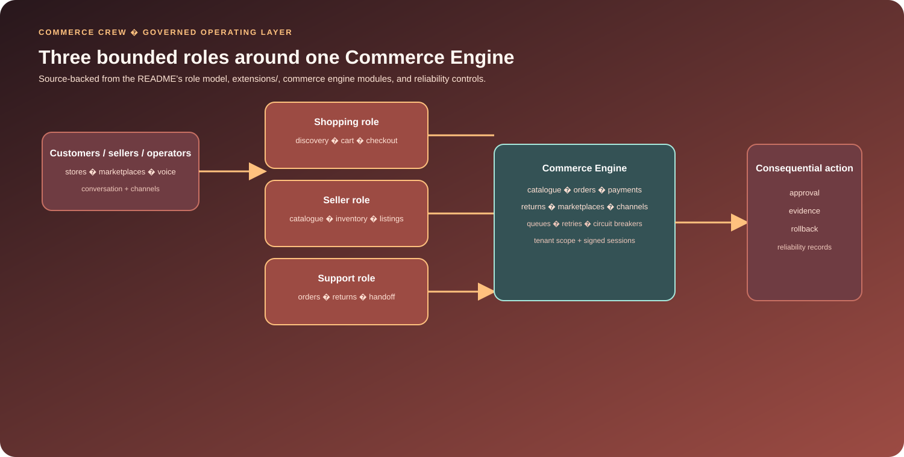

<div align="center">
  

# Commerce Crew Platform

### Governed conversational commerce, from discovery to fulfilment.

**A modular commerce workforce for customers, sellers, and operators across stores, marketplaces, messaging, and voice.**

</div>

<p align="center">
  <strong>Conversation-native</strong> &middot; <strong>Multi-channel</strong> &middot; <strong>Marketplace-aware</strong> &middot; <strong>Approval-governed</strong> &middot; <strong>Reliability-first</strong>
</p>


## Overview

Commerce Crew is a modular conversational-commerce extension suite that connects customer, seller and operator interactions to explicit commerce state, approval boundaries and provider integrations.


## Measured evidence

The cleanest standalone verification path is the Commerce Engine's payment primitive check. It contains **19 deterministic assertions** and requires no marketplace or payment-provider credentials.

| Primitive checked | What the script verifies |
| --- | --- |
| Payment state transitions | allowed forward transitions and rejected backwards/terminal transitions |
| Partial capture / refund arithmetic | remaining amounts are calculated in minor units |
| Refund state derivation | partial and full refund states are selected explicitly |
| Webhook signing | valid signed payloads are accepted |
| Webhook tampering | modified payloads are rejected |
| Webhook freshness | stale signatures outside the tolerance window are rejected |
| Event idempotency | provider event IDs produce stable keys across payload retries and isolate different event IDs |

Reproduce:

```bash
php extensions/chatbot-ecommerce/tests/run_payment_primitives.php
```

The repository also contains broader standalone `run_*` checks plus Laravel unit and feature tests. Those require the appropriate host context and should not be collapsed into one unsupported “all tests pass” claim.

## What is new

Commerce Crew's technical signature is a **governed transactional path for conversational commerce**, where model or operator intent does not bypass commerce state machines.

Key mechanisms include:

- **Prepared marketplace writes** with dry-run, approval, execution and partial rollback paths.
- **Reservation-aware inventory allocation** rather than trusting stale channel stock.
- **Explicit payment lifecycle modelling** for authorization, capture, partial capture and refunds.
- **Signed, idempotent webhook handling** around asynchronous provider events.
- **Retries, dead letters and circuit breakers** that make provider failure visible instead of silently losing work.
- **Unified order handling** while preserving external-system authority where required.

These controls are more important to the repository's engineering identity than the number of supported channels.

## Architecture

<p align="center">
  
</p>

Commerce Crew’s bounded roles and Commerce Engine keep consequential commerce actions reviewable.

## The product

Commerce Crew makes conversation an operating surface for commerce. It connects customer discovery, seller operations, support, marketplace work, and voice interactions to one Commerce Engine instead of leaving chat beside disconnected catalogues, inventory tools, order systems, and provider dashboards.

The platform is designed for teams that need to coordinate three different kinds of work:

- help a customer find and buy the right thing;
- help a seller manage catalogue, inventory, listings, orders, and exceptions;
- help support teams communicate with customers while respecting authority, policy, and human escalation.

## How the system works

Commerce Crew separates role responsibilities while keeping their commerce context shared:

```text
Customers / sellers / operators
               |
       Conversation + voice channels
               |
        +------+------+------+
        |             |      |
    Shopping       Seller  Support
       role          role    role
        |             |      |
        +------+------+------+
               |
        Commerce Engine
               |
  Catalogue | inventory | checkout | orders
  payments | returns | marketplaces | communications
               |
 Authority | evidence | approvals | rollback | reliability
```

Consequential work is bounded by explicit permissions, approval gates, signed sessions, tenant-aware context, evidence-preserving action history, and human handoff. The architecture treats authority as part of the product, not a prompt convention.

## Implemented capabilities

| Area | Implemented foundations |
| --- | --- |
| **Conversational commerce** | Product discovery, contextual shopping, budget locks, conversational cards, carts, checkout, and human handoff. |
| **Seller operations** | Catalogue and inventory management, listing intelligence, marketplace compliance, brand voice, and governed actions. |
| **Orders and fulfilment** | Native and external orders, fulfilment, returns, exception detection, and linked customer communication. |
| **Payments** | Payment lifecycle orchestration, signed webhooks, capture/refund flows, settlement reconciliation, and BNPL structures. |
| **Marketplaces** | Search, order import, governed writes, bulk operations, dry runs, rollback, and rate-limit controls. |
| **Inventory coordination** | Reservation-aware allocation, reconciliation, oversell protection, and conflict resolution. |
| **Channels** | Web conversation, WhatsApp, Messenger, Instagram, Telegram, voice interaction, and voice calls. |
| **Reliability** | Durable queues, retries, dead letters, circuit breakers, idempotent events, and lifecycle controls. |

The Commerce Engine represents catalogue, products, inventory, pricing, carts, checkout, tax, shipping, fulfilment, payments, orders, returns, and rental/hire receivables as first-class operational capabilities. Native and external orders can converge in a unified workbench while external systems retain authority where required.

## The engineering story

Commerce Crew's standout design choices are the boundaries around state-changing work:

- marketplace writes can be prepared, dry-run, approved, executed, and partially rolled back;
- inventory allocation accounts for reservations and protected stock rather than trusting stale channel state;
- payment workflows model authorization, capture, partial capture, refund, and asynchronous provider events;
- signed webhook verification and idempotent event handling protect state transitions;
- retries, dead letters, provider circuit breakers, and reconciliation make provider failure visible and recoverable.

## Extension suite

The bundle inventory records the following modules and responsibilities:

| Module | Responsibility |
| --- | --- |
| `chatbot/` | Shared conversation/runtime foundation: provider adapters, knowledge, structured actions, workflows, streaming, and channel delivery. |
| `chatbot-agent/` | Agent-workforce metadata and coordinated role capabilities. |
| `chatbot-ecommerce/` | Commerce Engine: contracts, models, migrations, routes, registries, authority middleware, queues, jobs, and commerce checks. |
| `chatbot-booking/` | Booking workflows. |
| `chatbot-customer-tag/` | Customer intelligence and segmentation. |
| `chatbot-instagram/`, `chatbot-messenger/`, `chatbot-telegram/`, `chatbot-whatsapp/` | Messaging channels. |
| `chatbot-voice/`, `chatbot-voice-call/` | Voice interaction and calling. |
| `chatbot-review/` | Reviews and feedback. |

## Code map

| Area | Entry points |
| --- | --- |
| Architecture | [`docs/ARCHITECTURE.md`](docs/ARCHITECTURE.md), [`docs/CAPABILITIES.md`](docs/CAPABILITIES.md) |
| Runtime foundation | [`extensions/chatbot/`](extensions/chatbot/) |
| Agent workforce | [`extensions/chatbot-agent/`](extensions/chatbot-agent/) |
| Transactional engine | [`extensions/chatbot-ecommerce/`](extensions/chatbot-ecommerce/) |
| Bundle inventory | [`bundle-inventory.json`](bundle-inventory.json) |
| Engine detail | [`extensions/chatbot-ecommerce/README.md`](extensions/chatbot-ecommerce/README.md) |

## Evidence and verification

The Commerce Engine contains primitive, contract, unit, and feature checks across catalogue, inventory, pricing, cart, checkout, payments, fulfilment, marketplace operations, the order workbench, tenant/credential boundaries, retries, circuit breakers, and lifecycle behavior.

With PHP available, a focused payment lifecycle check is:

```bash
php extensions/chatbot-ecommerce/tests/run_payment_primitives.php
```

The extension also contains a broader set of standalone `run_*` checks plus Laravel unit and feature tests. Run those inside a compatible host rather than treating this bundle as a complete application: the repository does not include the host's environment, provider credentials, or infrastructure configuration.

## Compatibility and setup

The Commerce Engine declares compatibility with PHP 8.2+, Laravel 10/11, MagicAI 10.91+, and Commerce Crew Core 7.7.0+. Supporting extensions retain their own contracts.

Install Commerce Crew through a compatible host application, then configure the host's Composer dependencies, database, queues, channels, marketplace credentials, and payment providers. Consult each extension README for package-specific setup.

## Scope and limitations

The repository demonstrates a governed extension surface: role-specific commerce tools, approval boundaries, provider adapters, durable state, and source-level verification. It does not by itself prove live marketplace writes, payment settlement, model-provider quality, every channel integration, or production readiness. Those require host-level integration fixtures, credentials, external systems, and deployment validation.

Some extension keys, namespaces, and provider identifiers retain compatibility-oriented names because they are part of installation and runtime contracts. Preserve those names when integrating the bundle.

## Documentation

- [`Architecture`](docs/ARCHITECTURE.md) - system layers, design principles, and operational boundaries.
- [`Capability Map`](docs/CAPABILITIES.md) - concise commerce, marketplace, security, and channel map.
- [`Commerce Engine`](extensions/chatbot-ecommerce/README.md) - engine-specific implementation and integration detail.

---

<div align="center">
  <strong>Commerce Crew</strong><br />
  Conversation becomes the operating surface for commerce.
</div>

