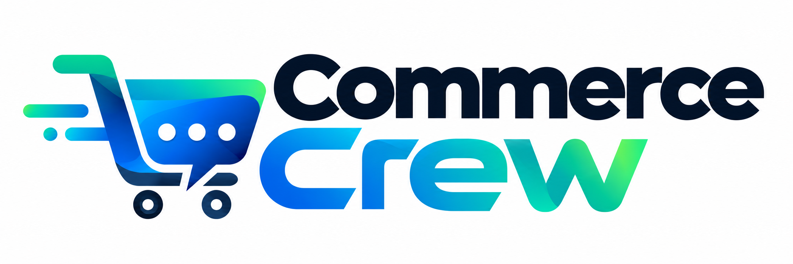
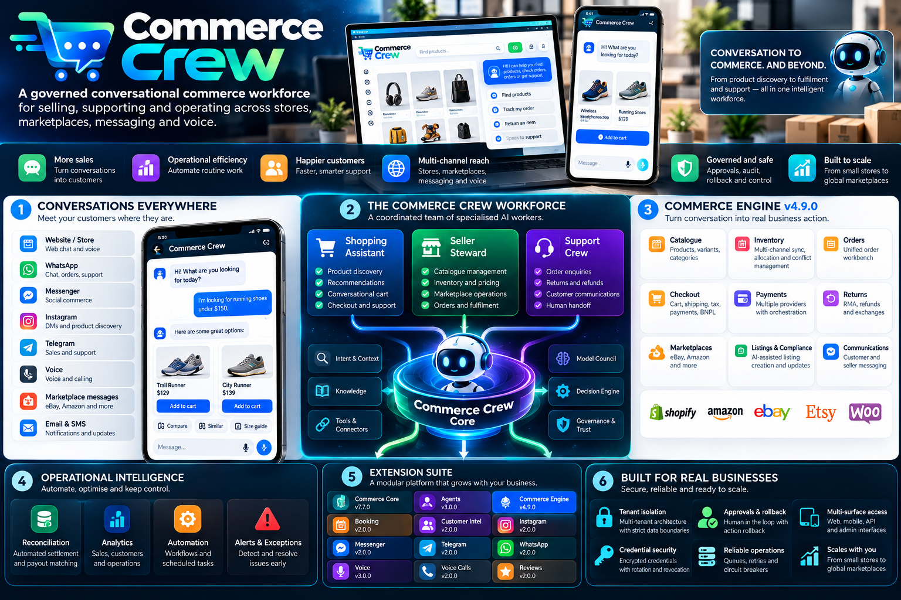

<div align="center">
  

# Commerce Crew

### Governed conversational commerce, from discovery to fulfilment.

**A modular commerce workforce for customers, sellers and operators across stores, marketplaces, messaging and voice.**

</div>

<p align="center">
  <strong>Conversation-native</strong> · <strong>Multi-channel</strong> · <strong>Marketplace-aware</strong> · <strong>Approval-governed</strong> · <strong>Reliability-first</strong>
</p>



---

## Overview

Commerce Crew is a modular conversational commerce platform that coordinates customer shopping, seller operations and support workflows through one governed operating layer.

Instead of placing a chat interface beside commerce systems, Commerce Crew connects conversation directly to catalogue discovery, inventory, carts, checkout, payments, orders, returns, marketplaces, communications and operational controls.

The platform combines an omnichannel interaction layer with the **Commerce Engine v4.9.0** and a suite of specialist modules for agents, booking, customer intelligence, social messaging, voice and reviews.

## Core capabilities

| Area | Capabilities |
|---|---|
| **Conversational commerce** | Product discovery, contextual shopping, budget locks, conversational cards, carts, checkout and human handoff |
| **Seller operations** | Catalogue and inventory management, listing intelligence, marketplace compliance, brand voice and governed actions |
| **Orders & fulfilment** | Native and external orders, fulfilment, returns, exception detection and customer communication linking |
| **Payments** | Payment lifecycle orchestration, signed webhooks, capture/refund flows, settlement reconciliation and BNPL |
| **Marketplaces** | Search, order import, governed writes, bulk operations, dry runs, rollback and rate-limit controls |
| **Inventory coordination** | Reservation-aware allocation, marketplace reconciliation, oversell protection and conflict resolution |
| **Channels** | Web conversation, WhatsApp, Messenger, Instagram, Telegram, voice and voice calls |
| **Governance** | Explicit authority, approvals, tenant isolation, signed sessions, credential protection and evidence-aware actions |
| **Reliability** | Durable queues, retries, dead letters, circuit breakers and lifecycle controls |

## How it works

```text
Customers / Sellers / Operators
              │
              ▼
     Conversation + Voice
              │
              ▼
        Commerce Crew
              │
     ┌────────┼────────┐
     ▼        ▼        ▼
 Shopping   Seller   Support
   Role     Role      Role
     │        │        │
     └────────┼────────┘
              ▼
        Commerce Engine
              │
   ┌──────────┼───────────┐
   ▼          ▼           ▼
Catalogue   Orders    Marketplaces
Inventory   Payments  Channels
Checkout    Returns   Communications
   │          │           │
   └──────────┼───────────┘
              ▼
   Authority · Evidence · Approvals
   Rollback · Isolation · Reliability
```

### Three-role operating model

Commerce Crew separates responsibilities instead of giving one general-purpose agent unrestricted access:

- **Shopping role** — assists customers with discovery, comparison, cart and checkout workflows.
- **Seller role** — supports catalogue, inventory, listings, marketplaces and operational decisions.
- **Support role** — coordinates order communications, exceptions, returns, escalation and human handoff.

Consequential operations remain bounded by explicit permissions and approval controls.

## Commerce Engine

The **Commerce Engine v4.9.0** is the transaction and operations core of Commerce Crew.

### Native commerce

Catalogue, products, inventory, pricing, carts, checkout, tax, shipping, fulfilment, payments, orders, returns and rental/hire receivables are represented as first-class commerce capabilities.

### Marketplace operations

Marketplace tooling supports search and read operations, order import, governed write preparation, approval-controlled execution, bulk operations, dry runs, partial rollback, listing intelligence and inventory reconciliation.

### Unified order workbench

Native and external orders converge into a common operational model for exception detection, settlement reconciliation, fulfilment status and linked customer communication while preserving the authority of external source systems where required.

### Inventory safety

Channel allocation accounts for protected stock buffers and reservations. Reconciliation detects stale state, oversell risk and undersell conditions. Automated preparation can be policy-bounded while execution remains separately governed.

### Payment integrity

Payment workflows model authorization, capture, partial capture, refund states and asynchronous provider events. Signed webhook verification and idempotent event handling protect state transitions.

## Governance and security

Commerce Crew treats authority as a product feature rather than an implementation detail.

- Capability-scoped signed commerce sessions
- Least-privilege route permissions
- Tenant isolation and fail-closed public-session handling
- Credential redaction, rotation and revocation controls
- Approval gates for consequential actions
- Human handoff and escalation paths
- Rollback-aware marketplace operations
- Evidence-preserving operational flows

## Reliability engineering

External providers and marketplaces are assumed to fail occasionally. Commerce Crew includes defensive infrastructure for those failure modes:

- Deterministic retry backoff
- Durable queues and dead-letter handling
- Provider circuit breakers
- Lifecycle-aware request serving
- Idempotent asynchronous event handling
- Explicit reconciliation rather than silent state assumptions

## Extension suite

| Module | Version | Responsibility |
|---|---:|---|
| **Commerce Crew Core** | 7.7.0 | Conversation and shared platform foundation |
| **Commerce Crew Agents** | 3.0.0 | Coordinated agent workforce capabilities |
| **Commerce Crew Commerce Engine** | **4.9.0** | Conversational, transactional and marketplace commerce |
| Commerce Crew Booking | 2.0.0 | Booking workflows |
| Commerce Crew Customer Intelligence | 2.0.0 | Customer tagging and segmentation |
| Commerce Crew Instagram | 2.0.0 | Instagram Direct integration |
| Commerce Crew Messenger | 2.0.0 | Messenger integration |
| Commerce Crew Telegram | 2.0.0 | Telegram integration |
| Commerce Crew WhatsApp | 2.0.0 | WhatsApp integration |
| Commerce Crew Voice | 3.0.0 | Voice interaction |
| Commerce Crew Voice Calls | 2.0.0 | Voice calling |
| Commerce Crew Reviews | 2.0.0 | Reviews and feedback |

## Repository structure

```text
Commerce-Crew/
├── docs/
│   ├── images/                 # Product artwork
│   ├── ARCHITECTURE.md         # Architecture overview
│   └── CAPABILITIES.md         # Capability map
├── extensions/
│   ├── chatbot/                # Commerce Crew Core
│   ├── chatbot-agent/          # Agent workforce
│   ├── chatbot-ecommerce/      # Commerce Engine v4.9.0
│   ├── chatbot-booking/        # Booking workflows
│   ├── chatbot-customer-tag/   # Customer intelligence
│   ├── chatbot-instagram/      # Instagram channel
│   ├── chatbot-messenger/      # Messenger channel
│   ├── chatbot-telegram/       # Telegram channel
│   ├── chatbot-whatsapp/       # WhatsApp channel
│   ├── chatbot-voice/          # Voice interaction
│   ├── chatbot-voice-call/     # Voice calling
│   └── chatbot-review/         # Reviews and feedback
└── bundle-inventory.json       # Extension inventory
```

Some internal extension keys, namespaces and provider identifiers use compatibility-oriented technical names because they form part of installation, dependency and runtime contracts.

## Platform compatibility

The Commerce Engine declares compatibility with:

- **PHP 8.2+**
- **Laravel 10 / 11**
- **MagicAI 10.91+**
- **Commerce Crew Core 7.7.0+**

Supporting modules retain their own compatibility contracts.

## Verification

The Commerce Engine includes primitive, contract, unit and feature-level checks across its core operational boundaries, including:

- Native catalogue and commerce foundations
- Inventory, pricing, cart, checkout, tax and shipping
- Orders, fulfilment and returns
- Payments, BNPL and rental/hire workflows
- Conversational commerce and commerce context
- Marketplace read/write and bulk operations
- Listing intelligence and inventory conflicts
- Unified order workbench behavior
- Credential and tenant hardening
- Session authority and permission boundaries
- Retry, circuit-breaker and lifecycle behavior

## Documentation

- [`Architecture`](docs/ARCHITECTURE.md) — system layers, design principles and operational boundaries
- [`Capability Map`](docs/CAPABILITIES.md) — concise map of commerce, marketplace, security and channel capabilities
- [`Commerce Engine`](extensions/chatbot-ecommerce/README.md) — engine-specific implementation and integration detail

---

<div align="center">
  <strong>Commerce Crew</strong><br />
  Conversation becomes the operating surface for commerce.
</div>
